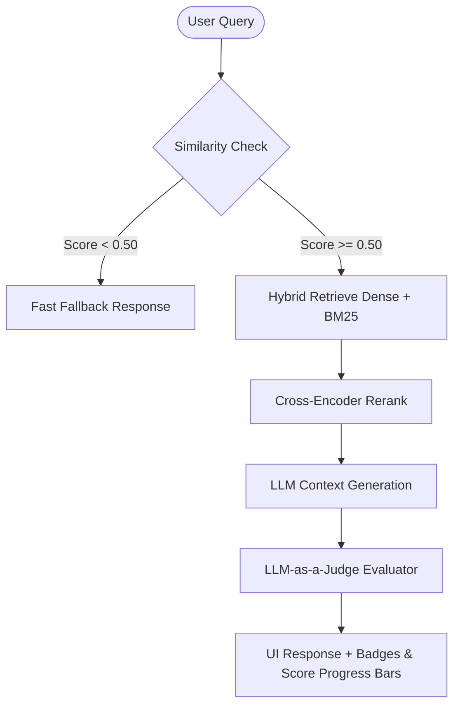

# Production-Grade Document RAG Assistant

A local, private, fast, and self-auditing Retrieval-Augmented Generation (RAG) assistant. It allows you to upload, index, filter, and query documents with absolute privacy.

---

## 🚀 Key Features

1. **Dynamic PDF Ingestion:** Upload and index new PDF documents instantly through the sidebar. Chunks are embedded and added to Qdrant in memory without losing previously indexed documents.
2. **Conversational Memory:** Multi-turn chat interface. Message history is preserved in Redis, and follow-up questions are automatically rephrased into standalone database queries using your local LLM.
3. **Metadata Filtering (Search Focus):** Restrict your search focus dynamically using the sidebar selector. Only documents you choose will be queried.
4. **Hybrid Search + Cross-Encoder Reranking:**
   * **Stage 1 (Retrieval):** Performs a hybrid search in Qdrant combining Dense Vectors and Sparse Vectors (BM25) fused using Reciprocal Rank Fusion (RRF).
   * **Stage 2 (Reranking):** Scores the top 20 candidate chunks with a local Cross-Encoder model (`Xenova/ms-marco-MiniLM-L-6-v2` via `fastembed`) to feed only the top 3 most relevant passages to the LLM.
5. **Post-Retrieval Similarity Thresholding:** Instantly rejects off-topic queries (e.g. recipes, coding, general chitchat) in under **3ms** by checking vector distance scores, saving GPU/CPU cycles.
6. **Local Self-Auditing Evaluation:** Evaluates every answer in the background using the LLM-as-a-Judge technique. Shows **Faithfulness** (hallucination detection) and **Relevance** scores directly inside the chat bubbles.

---

## 🛠️ Technology Stack

* **Backend:** FastAPI (Python)
* **Frontend:** Streamlit
* **Vector Database:** Qdrant
* **In-Memory Cache & Session Memory:** Redis
* **Embeddings & LLM Engine:** Ollama (local)
* **Reranker:** FastEmbed (local CPU-optimized ONNX model)

---

## 📦 Prerequisites

Ensure you have the following installed and running:
1. **Python 3.11+**
2. **Docker & Docker Compose**
3. **Ollama** (Running locally)
   * Pull models:
     ```bash
     ollama pull nomic-embed-text
     ollama pull llama3.1
     ```

---

## ⚙️ Setup and Installation

### 1. Start Docker Services (Qdrant & Redis)
Navigate to the directory and spin up Qdrant and Redis:
```bash
docker compose up -d
```

### 2. Configure Local Environment
Create a `.env` file in the root directory:
```env
QDRANT_URL=http://localhost:6333
REDIS_HOST=localhost
REDIS_PORT=6379
EMBEDDING_MODEL=nomic-embed-text
EMBEDDING_DIM=768
LLM_MODEL=llama3.1
COLLECTION_NAME=rag_documents
```

### 3. Install Python Dependencies
Create a virtual environment and install requirements:
```bash
python3 -m venv venv
source venv/bin/activate
pip install -r requirements.txt
```

### 4. Run the Application
Start the services in two separate terminal windows:

* **Start FastAPI Backend:**
  ```bash
  source venv/bin/activate
  uvicorn app.main:app --port 8001 --reload
  ```

* **Start Streamlit Frontend:**
  ```bash
  source venv/bin/activate
  streamlit run frontend.py
  ```

Open your browser at **http://localhost:8502** to start chatting with your documents!

---

## 📊 RAG Pipeline Architecture


